# DesafioAec — Teste Prático Dev C# (AeC)

Aplicação web em C# desenvolvida como teste prático para o time de Sistemas da AeC. Permite que o usuário faça login e gerencie um CRUD completo de endereços, com preenchimento automático via API do ViaCEP e exportação para CSV.

---

### Funcionalidades

#### Autenticação
- Cadastro de conta (nome, usuário, senha)
- Login com validação de credenciais (BCrypt)
- Redirecionamento para a listagem de endereços após login bem-sucedido
- Redirecionamento inverso: usuários já autenticados que acessam `/auth/login` ou `/auth/register` são enviados para `/addresses` automaticamente (com verificação de expiração real do cookie)

#### CRUD de Endereços
- **Listar** — visualização em grade ou lista (preferência salva no navegador via `localStorage`)
- **Detalhar** — página com todas as informações do endereço
- **Criar** — formulário com preenchimento automático ao digitar o CEP (integração ViaCEP) e apelido único por usuário
- **Editar** — mesma integração ViaCEP disponível na edição
- **Excluir** — botão com modal de confirmação inline (sem página extra)
- **Seleção em lote** — selecione múltiplos endereços via checkbox; barra de ações aparece com opções de exportar ou excluir em lote
- **Copiar endereço** — copia o endereço formatado para a área de transferência com feedback visual

#### Exportação CSV
- Exportar **todos** os endereços do usuário logado em um único arquivo CSV
- Exportar **endereços selecionados** (`GET /addresses/export/selection?ids=1,2,3`)
- Exportar um **endereço individual** diretamente da lista ou da página de detalhes

#### Integração ViaCEP
- Endpoint interno `GET /addresses/cep/{cep}` que consulta a API pública do ViaCEP
- Ao informar o CEP nos formulários de criação/edição, os campos de logradouro, bairro, cidade, UF e complemento são preenchidos automaticamente
- Link "Não sei meu CEP" nos formulários aponta para a ferramenta de busca dos Correios

---

### Tecnologias

| Camada | Tecnologia |
|--------|-----------|
| Backend | ASP.NET MVC (.NET 10) |
| ORM | Entity Framework Core 10 |
| Banco de dados | SQL Server (via Docker) |
| Frontend | Razor Views + Tailwind CSS |
| Integração externa | ViaCEP API |

---

### Estrutura do banco de dados

#### Tabela `Users`

| Coluna | Tipo | Observação |
|--------|------|-----------|
| Id | INT IDENTITY | PK |
| Name | NVARCHAR(100) | Nome completo |
| Username | NVARCHAR(50) | Único |
| Password | NVARCHAR(MAX) | Hash BCrypt |

#### Tabela `Addresses`

| Coluna | Tipo | Observação |
|--------|------|-----------|
| Id | INT IDENTITY | PK |
| Name | NVARCHAR(100) | Nome/rótulo do endereço (único por usuário) |
| CEP | NVARCHAR(8) | Sem máscara |
| PublicPlace | NVARCHAR(200) | Logradouro |
| Complement | NVARCHAR(100) | Opcional (nullable) |
| District | NVARCHAR(100) | Bairro |
| City | NVARCHAR(100) | Cidade |
| FederalUnit | NVARCHAR(2) | UF |
| Number | NVARCHAR(10) | Número |
| UserId | INT | FK → Users(Id) CASCADE DELETE |

#### Script SQL de criação

```sql
CREATE TABLE Users (
    Id          INT IDENTITY(1,1) PRIMARY KEY,
    Name        NVARCHAR(100)  NOT NULL,
    Username    NVARCHAR(50)   NOT NULL,
    Password    NVARCHAR(MAX)  NOT NULL,
    CONSTRAINT UQ_Users_Username UNIQUE (Username)
);

CREATE TABLE Addresses (
    Id          INT IDENTITY(1,1) PRIMARY KEY,
    Name        NVARCHAR(100)  NOT NULL,
    CEP         NVARCHAR(8)    NOT NULL,
    PublicPlace NVARCHAR(200)  NOT NULL,
    Complement  NVARCHAR(100)  NULL,
    District    NVARCHAR(100)  NOT NULL,
    City        NVARCHAR(100)  NOT NULL,
    FederalUnit NVARCHAR(2)    NOT NULL,
    Number      NVARCHAR(10)   NOT NULL,
    UserId      INT            NOT NULL,
    CONSTRAINT FK_Addresses_Users FOREIGN KEY (UserId)
        REFERENCES Users(Id) ON DELETE CASCADE
);

CREATE INDEX IX_Addresses_UserId ON Addresses (UserId);
CREATE UNIQUE INDEX IX_Addresses_Name_UserId ON Addresses (Name, UserId);
```


---

## Fluxo do usuário

### 1. Cadastro

Novo usuário preenche nome, usuário e senha para criar uma conta.

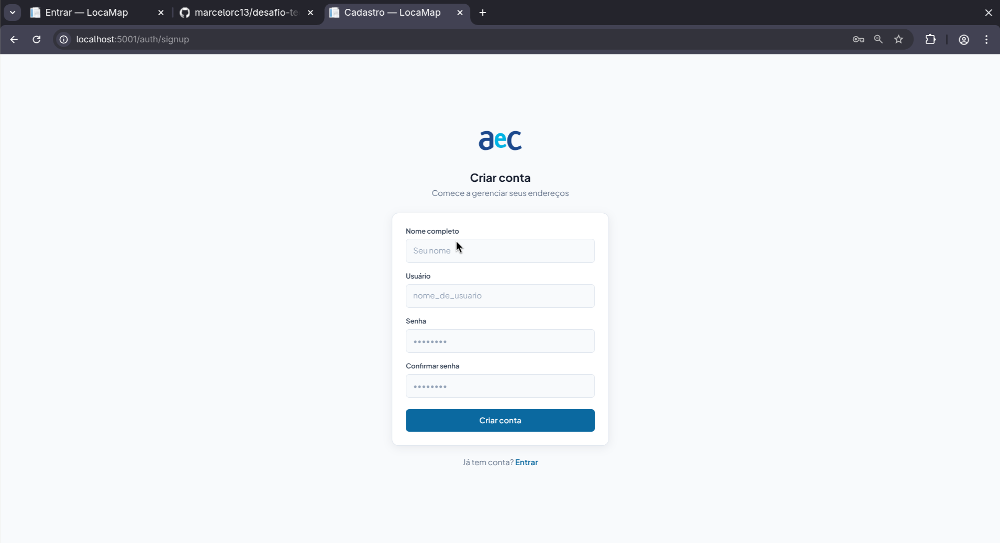

### 2. Login

Autenticação com usuário e senha. Usuários já autenticados são redirecionados direto para `/addresses`.

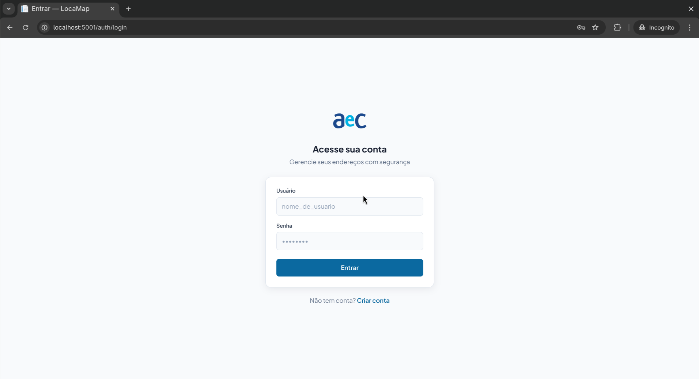

### 3. Lista vazia

Estado inicial quando o usuário ainda não cadastrou nenhum endereço.

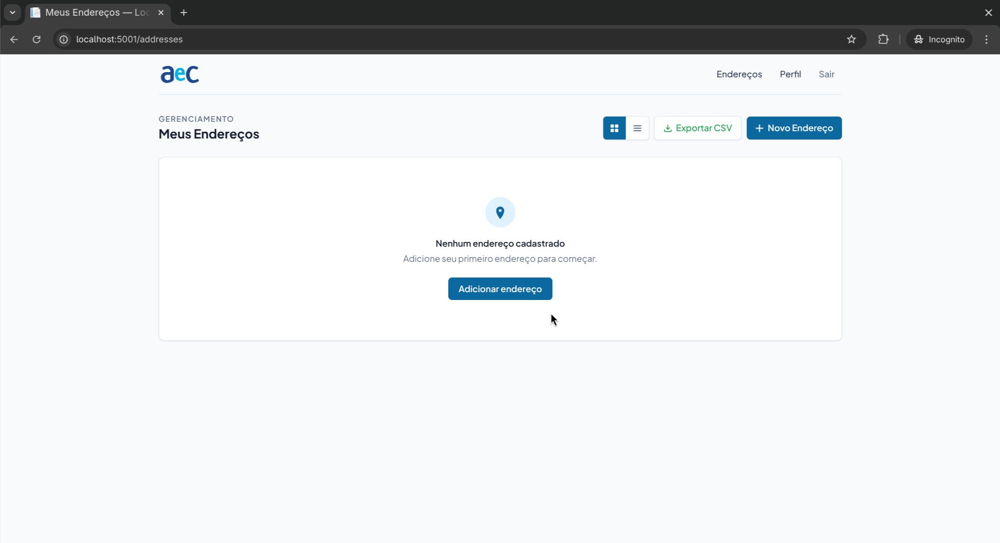

### 4. Lista de endereços — grade

Visão em grade dos endereços cadastrados. O layout (grade ou lista) é salvo no navegador via `localStorage`.

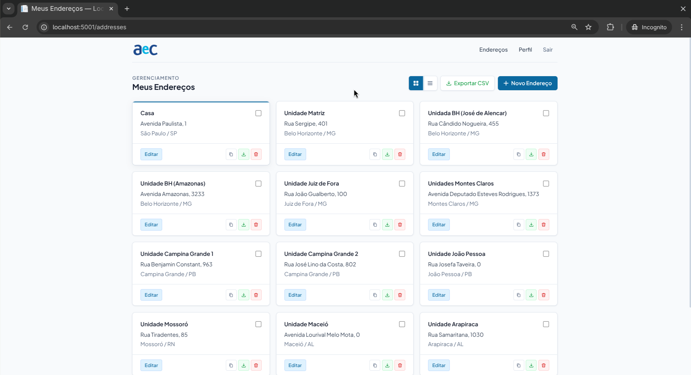

### 5. Lista de endereços — lista

Visão alternativa em lista.

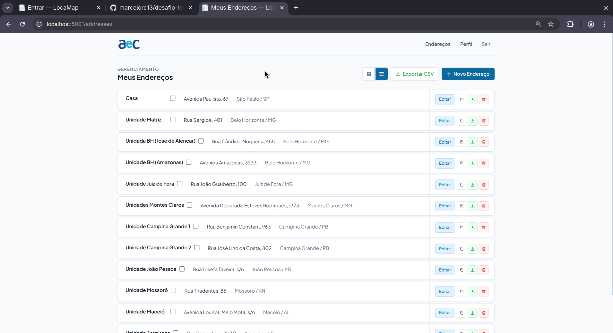


### 6. Criar endereço

Formulário de criação com preenchimento automático dos campos ao digitar o CEP (integração ViaCEP).

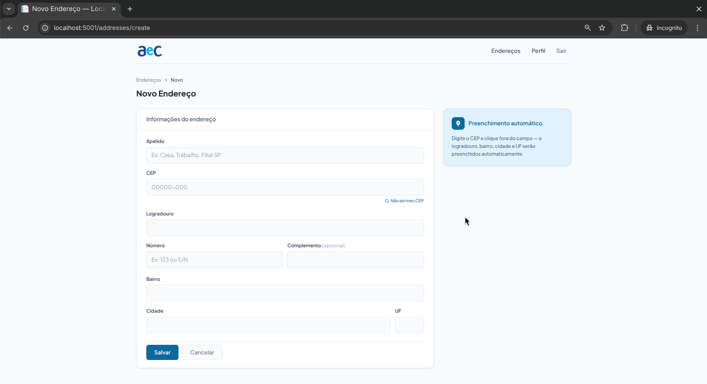

### 7. Detalhes do endereço

Visualização completa de um endereço com opções de editar, exportar CSV e copiar para área de transferência.

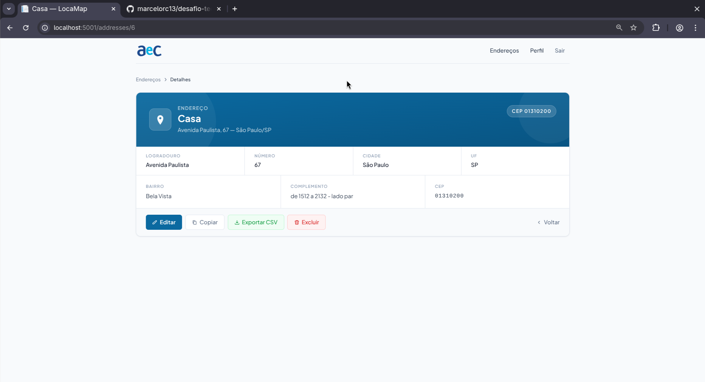

### 8. Editar endereço

Formulário de edição com os mesmos recursos de preenchimento automático via CEP.

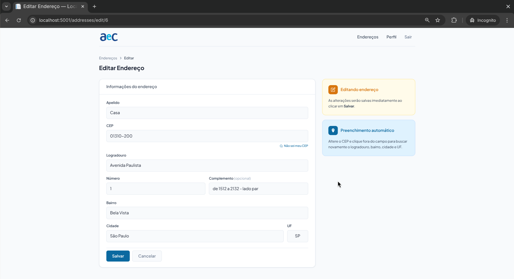

### 9. Excluir endereço

Modal de confirmação inline antes de excluir um endereço individual.

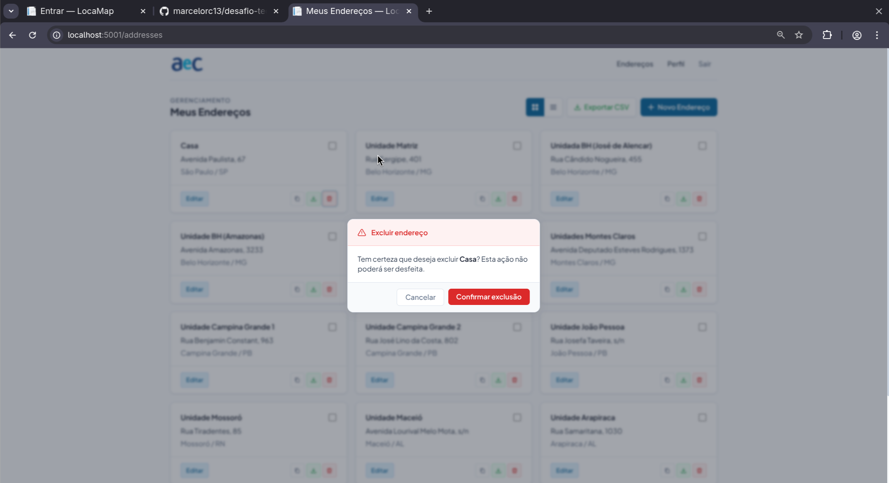

### 10. Seleção em lote — grade

Seleção de múltiplos endereços via checkbox na visão em grade. Uma barra de ações aparece com opções de exportar ou excluir em lote.

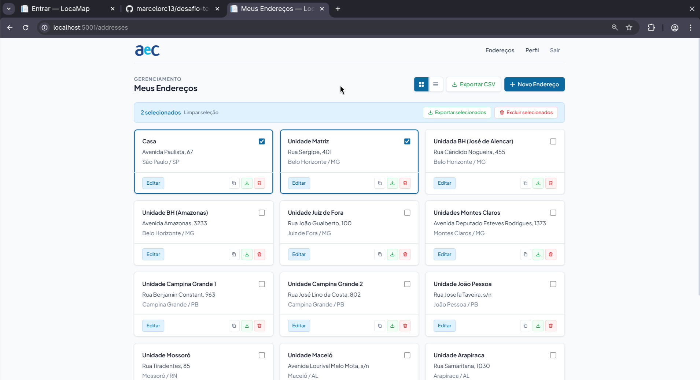

### 11. Seleção em lote — lista

Mesma seleção em lote na visão de lista.

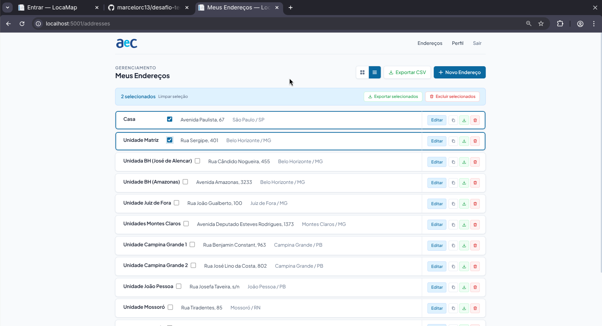

### 12. Excluir seleção

Modal de confirmação antes de excluir os endereços selecionados em lote.

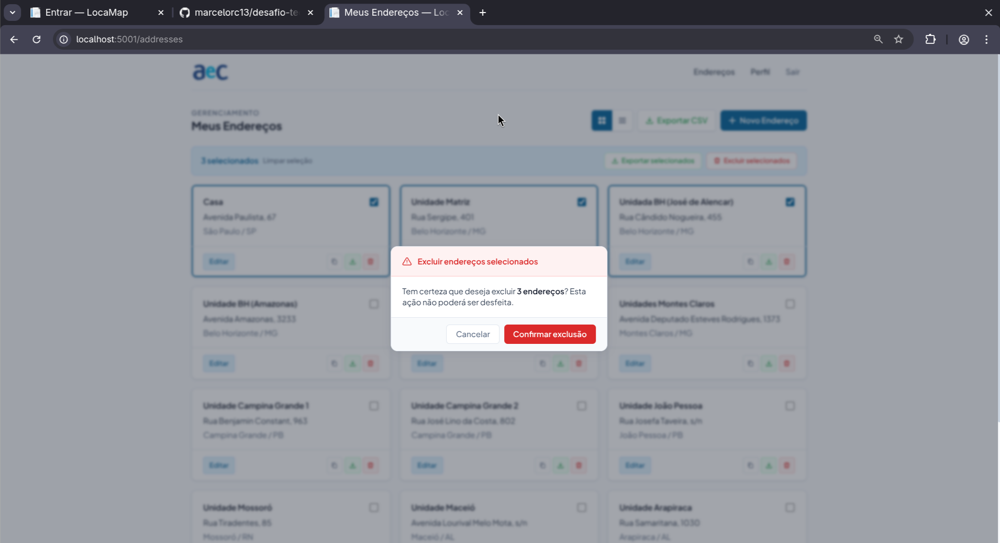

### 13. Exportar todos os endereços

CSV gerado com todos os endereços do usuário logado.

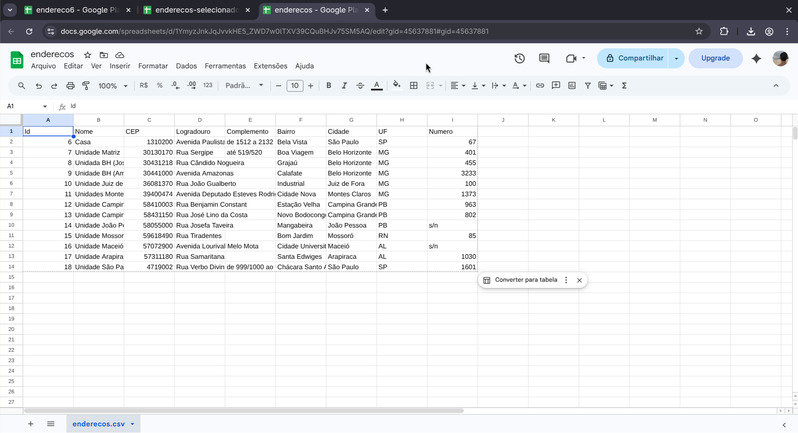

### 14. Exportar endereços selecionados

CSV gerado a partir da seleção em lote.

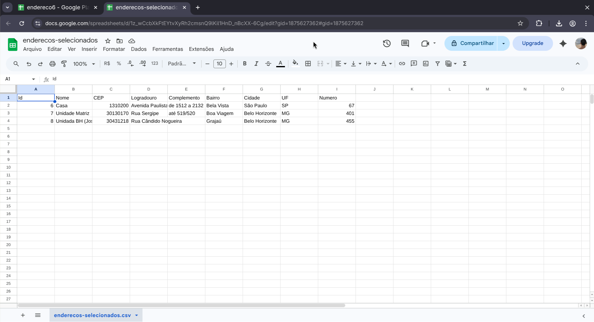

### 15. Exportar endereço individual

CSV de um único endereço exportado da lista ou da página de detalhes.

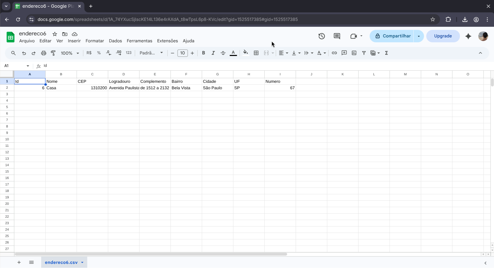


### 16. Perfil

Página de perfil com nome e usuário do usuário autenticado.

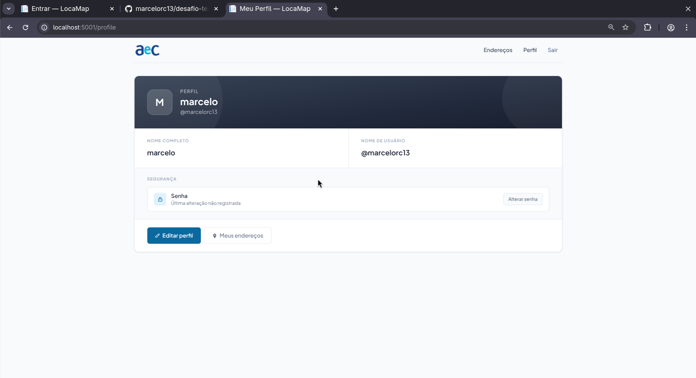

### 17. Editar perfil

Formulário para atualizar nome e usuário.

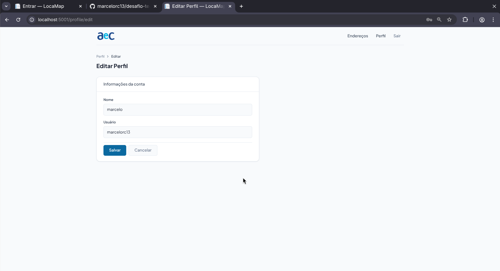

### 18. Alterar senha

Formulário para troca de senha com confirmação.

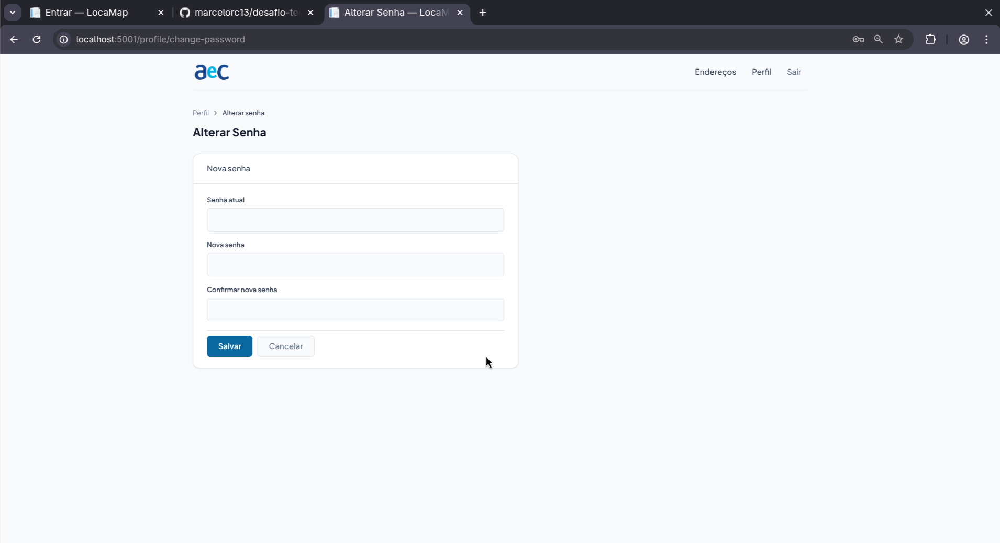

---

## Executando localmente

### Requisitos

- [.NET 10 SDK](https://dotnet.microsoft.com/download)
- [Docker](https://www.docker.com/)

### Primeiro uso (setup completo)

Clone o repositório e execute o setup com um único comando:

```bash
git clone https://github.com/youruser/DesafioAec.git
cd DesafioAec
make setup PASSWORD=YourPassword123
```

Isso irá: iniciar o SQL Server via Docker, configurar a string de conexão via user-secrets e aplicar as migrations.

Em seguida, suba a aplicação:

```bash
make run/app
```

A aplicação estará disponível em `http://localhost:5001`.

---

### Comandos disponíveis (`make`)

| Comando | Descrição |
|---------|-----------|
| `make setup PASSWORD=<senha>` | Setup completo: DB + secrets + migrations |
| `make run/db PASSWORD=<senha>` | Inicia o container SQL Server |
| `make stop/db` | Para e remove o container SQL Server |
| `make setup/secrets PASSWORD=<senha>` | Configura a connection string via user-secrets |
| `make migrations/up` | Aplica as migrations pendentes |
| `make migrations/add NAME=<Nome>` | Cria uma nova migration |
| `make build` | Compila a aplicação |
| `make run/app` | Executa a aplicação com hot reload |

> O valor padrão de `PASSWORD` é `YourPassword123`. Todos os comandos `dotnet` são executados a partir do diretório `App/`.

---

### Fluxo da aplicação

```
/auth/register  →  Cadastro de conta
/auth/login     →  Login
                      ↓
/addresses      →  Lista de endereços (grade ou lista)
                      ├── /addresses/create     →  Criar endereço (auto-fill via CEP)
                      ├── /addresses/{id}       →  Detalhes do endereço
                      ├── /addresses/edit/{id}  →  Editar endereço
                      ├── /addresses/delete/{id}         →  Excluir (confirmado por modal)
                      ├── /addresses/delete/selection    →  Excluir em lote (POST)
                      ├── /addresses/export              →  CSV de todos os endereços
                      ├── /addresses/export/selection    →  CSV de endereços selecionados
                      └── /addresses/export/{id}         →  CSV de um endereço
```
